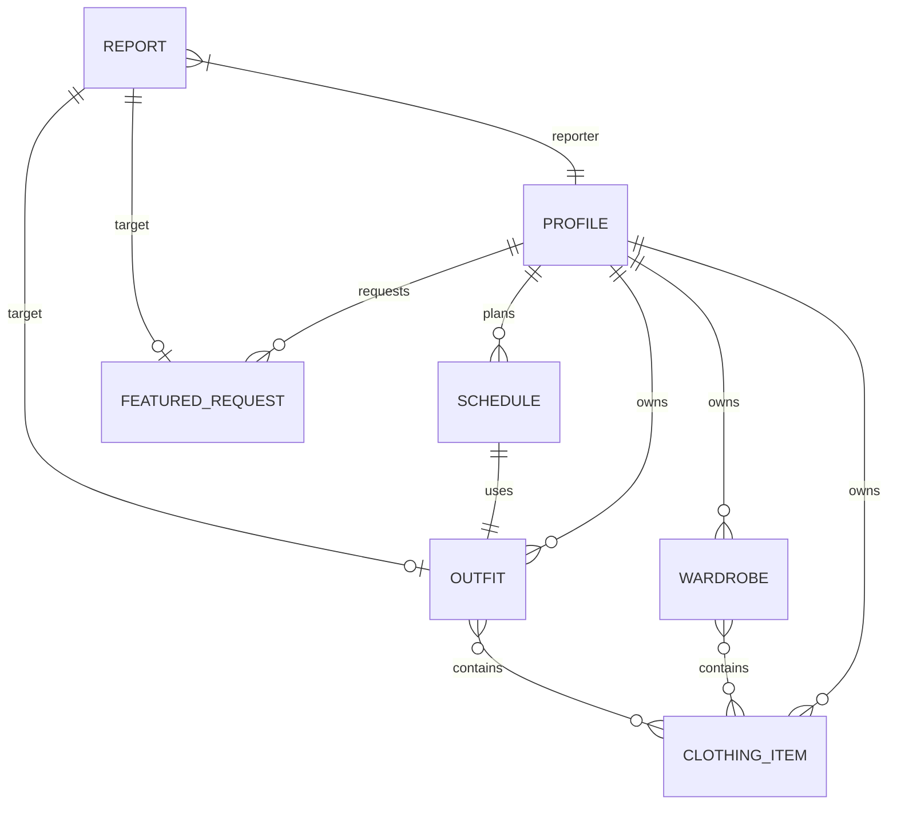

# Software Requirements Specification (SRS) for Fit App

**Version**: 1.0  
**Project Name**: Fit App - Advanced Wardrobe Management System  
**Frameworks**: Flutter, Django (DRF), PostgreSQL, Firebase  
**AI Engine**: Gemini 1.5/2.5 Flash Lite  
**Date**: April 18, 2026  

---

## 1. Introduction

### 1.1 Purpose
The purpose of this document is to provide a comprehensive description of the software requirements for the **Fit App**. It defines the functional and non-functional requirements, project scope, system architecture, and user interfaces. This document serves as the primary reference for developers, designers, and stakeholders throughout the development and maintenance lifecycle.

### 1.2 Scope
Fit App is a full-stack mobile ecosystem designed for fashion enthusiasts. It provides tools for digital wardrobe management, AI-driven styling recommendations, social style discovery, and a premium monetization framework. The system includes:
- A **Flutter Mobile Application** for end-users.
- A **Django REST API** for backend logic and data management.
- A **Web-based Admin Panel** for moderation and system governance.
- Integration with **AI (Gemini)** for styling and **Payment Gateways (Stripe/Khalti)** for monetization.

### 1.3 Definitions, Acronyms, and Abbreviations
- **MVP**: Minimum Viable Product.
- **DRF**: Django Rest Framework.
- **JWT**: JSON Web Token (used for authentication).
- **FCM**: Firebase Cloud Messaging (for push notifications).
- **CRUD**: Create, Read, Update, Delete.
- **Featured Wardrobe**: A premium service where a user's collection is spotlighted to the global community.

---

## 2. Overall Description

### 2.1 Product Perspective
Fit App is a standalone ecosystem that integrates with external services:
- **Firebase**: For Authentication and Push Notifications.
- **Stripe/Khalti**: For payment processing and transaction verification.
- **Gemini API**: For processing natural language style requests and wardrobe analysis.
- **rembg**: For professional-grade background removal in clothing photography.

### 2.2 Product Functions
- **Profile Management**: Tiered user accounts (Free/Premium).
- **Digital Closet**: CRUD operations for clothing items with AI background removal.
- **Wardrobe & Outfits**: Logical grouping of items and creation of sets (Tops, Bottoms, etc.).
- **AI Stylist**: Weather-aware and occasion-based outfit generation using LLMs.
- **Scheduling**: Calendar-based planning of daily looks with conflict prevention.
- **Social Discovery**: Global feed of public outfits, verified badges, and featured lookbooks.
- **Monetization**: Subscription-based upgrades and one-time payment features.
- **Moderation**: Reporting system and admin control over user-generated content.

### 2.3 User Classes and Characteristics
- **Free User**: Limited storage (25 items, 5 wardrobes) and restricted AI usage (once daily).
- **Premium User**: Unlimited storage, unlimited AI stylist access, and priority features.
- **Moderator/Admin**: Access to the admin panel to review reports, approve featured content, and manage users.
- **Superadmin**: Global control, manages permissions, and cannot be moderated by regular admins.

### 2.4 Operating Environment
- **Frontend**: Android/iOS (Flutter).
- **Backend**: Python-based Django server (Local development environment).
- **Database**: PostgreSQL (Local/Container-based).
- **Storage**: Local filesystem for media assets and database backups.

---

## 3. External Interface Requirements

### 3.1 User Interfaces
- **Mobile app**: High-aesthetic, modern UI with dark mode support, smooth transitions, and intuitive gesture-based navigation.
- **Admin Panel**: Responsive web-based dashboard for desktop/tablet use.

### 3.2 Software Interfaces
- **Authentication**: Firebase Admin SDK (Server) + Firebase Auth (Client).
- **Payments**: Stripe Webhooks (Secure) + Khalti Lookup API.
- **Push Notification**: Firebase Cloud Messaging (FCM).
- **AI**: Google Generative AI (Gemini) API.

---

## 4. System Features & Functional Requirements

### 4.1 Wardrobe Management
- **FR.1.1**: The system shall allow users to upload clothing images.
- **FR.1.2**: The system shall automatically remove image backgrounds using `rembg`.
- **FR.1.3**: The system shall categorize items based on `item_type` (Top, Bottom, Shoes, etc.).
- **FR.1.4**: The system shall enforce "Safe Delete" logic, reassigning items from deleted categories to "Other".

### 4.2 AI Stylist & Analysis
- **FR.2.1**: The system shall generate outfit recommendations based on local weather conditions.
- **FR.2.2**: The system shall analyze the user's closet to identify "Essential Gaps" in their wardrobe.
- **FR.2.3**: The system shall enforce daily limits for Free users (resets at midnight).

### 4.3 Payments & Subscriptions
- **FR.3.1**: The system shall support Stripe for international payments and Khalti for local payments.
- **FR.3.2**: The system shall use webhooks and lookup APIs to ensure payment status is synchronized even if the app crashes.
- **FR.3.3**: The system shall automate refunds through the admin panel for rejected "Featured Wardrobe" requests.

### 4.4 Social & Discovery
- **FR.4.1**: The system shall provide a public feed of outfits with privacy controls.
- **FR.4.2**: The system shall allow users to "Save" (bookmark) public outfits from other users.
- **FR.4.3**: The system shall display verified badges for featured accounts.

### 4.5 Planning & Notifications
- **FR.5.1**: The system shall allow users to schedule outfits for future dates.
- **FR.5.2**: The system shall send daily push notifications in the morning with the scheduled outfit.
- **FR.5.3**: The system shall track "Wear Count" for each item used in a schedule.

---

## 5. Non-Functional Requirements

### 5.1 Security Requirements
- **SR.1**: All API requests must be verified against a valid Firebase JWT.
- **SR.2**: Ownership verification must be performed server-side for all CRUD operations.
- **SR.3**: Stripe webhooks must verify signatures to prevent spoofing.

### 5.2 Performance Requirements
- **PR.1**: AI background removal should complete within 3-5 seconds.
- **PR.2**: Mobile app navigation transitions should maintain 60FPS.
- **PR.3**: Dashboard statistics should refresh with less than 200ms latency.

### 5.3 Reliability & Scalability
- **RS.1**: The system shall handle at least 1,000 concurrent users without degradation.
- **RS.2**: Database integrity must be maintained using relational constraints and transactions.

---

## 6. Entity Relationship Diagram (Conceptual)

---

## 7. Future Roadmap
1. P2P Messaging for fashion consultations.
2. AR Try-on integration for virtual fitting.
3. Affiliate marketplace for direct shop links.
